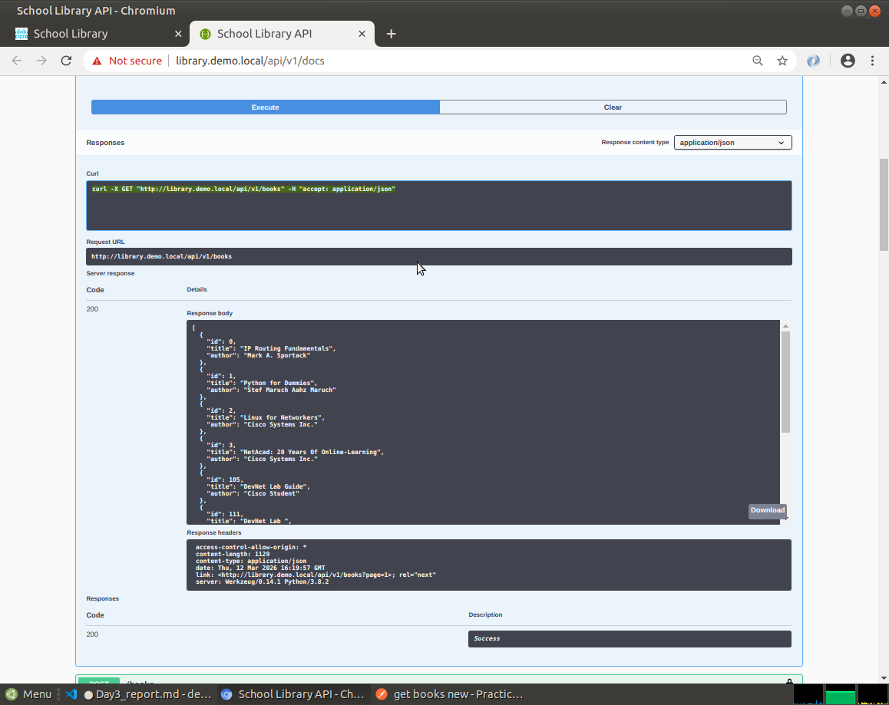
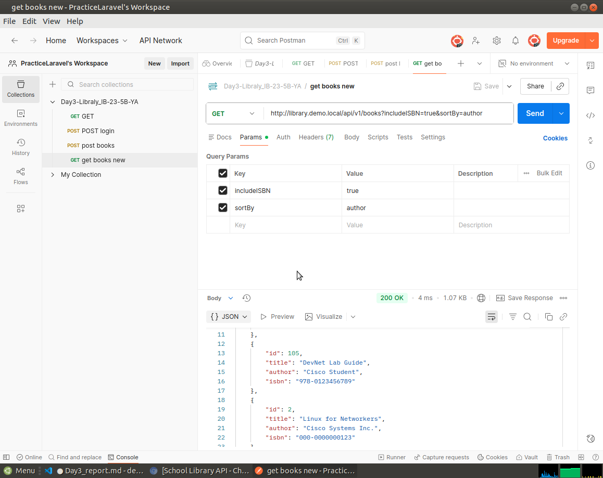
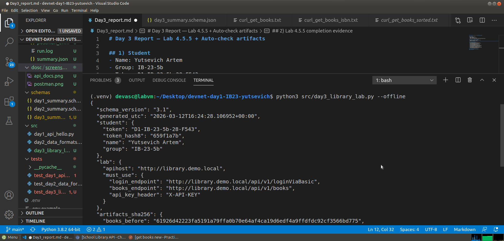
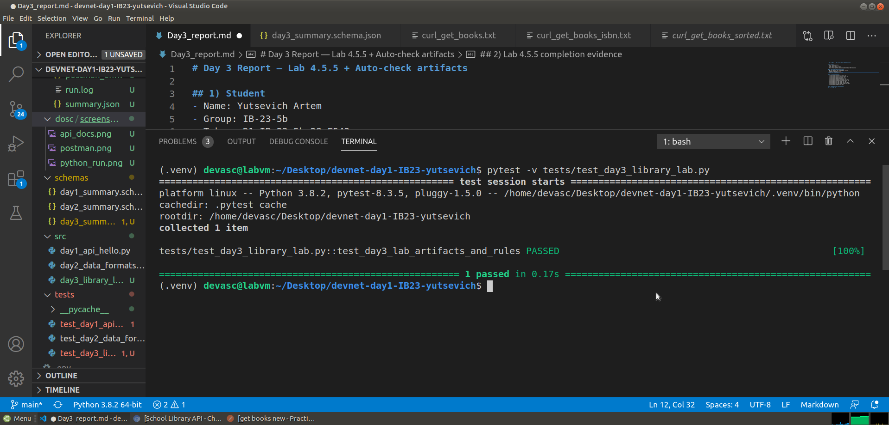

# Day 3 Report — Lab 4.5.5 + Auto-check artifacts

## 1) Student
- Name: Yutsevich Artem
- Group: IB-23-5b
- Token: D1-IB-23-5b-28-F543
- Repo: https://github.com/youz1iq/devnet-day1-IB23-Yutsevich

## 2) Lab 4.5.5 completion evidence

- **API docs (Try it out) screenshot:**


- **Postman screenshot:**


- **Python run screenshot:**


- **Pytest Results screenshot:**


## 3) Artifacts checklist
- artifacts/day3/books_before.json: Yes
- artifacts/day3/books_sorted_isbn.json: Yes
- artifacts/day3/mybook_post.json: Yes
- artifacts/day3/books_by_me.json: Yes
- artifacts/day3/add100_report.json: Yes
- artifacts/day3/postman_collection.json: Yes
- artifacts/day3/postman_environment.json: Yes
- artifacts/day3/curl_get_books.txt: Yes
- artifacts/day3/curl_get_books_isbn.txt: Yes
- artifacts/day3/curl_get_books_sorted.txt: Yes
- artifacts/day3/summary.json: Yes

## 4) Command outputs (paste exact)
### 4.1 Script run
```bash
(.venv) devasc@labvm:~/Desktop/devnet-day1-IB23-yutsevich$ python3 src/day3_library_lab.py --offline
{
  "schema_version": "3.1",
  "generated_utc": "2026-03-12T16:42:56.955944+00:00",
  "student": {
    "token": "D1-IB-23-5b-28-F543",
    "token_hash8": "659f1a7b",
    "name": "Yutsevich Artem",
    "group": "IB-23-5b"
  },
  "lab": {
    "apihost": "http://library.demo.local",
    "must_use": {
      "login_endpoint": "http://library.demo.local/api/v1/loginViaBasic",
      "books_endpoint": "http://library.demo.local/api/v1/books",
      "api_key_header": "X-API-KEY"
    }
  },
  "artifacts_sha256": {
    "books_before": "61926d42223fa5191a79ffa0b70e64af4ca19d6edf4a9ffdfdc92cf3566bd775",
    "books_sorted_isbn": "df07e83ef6b599710d5a0d931151775c678230ba52f02cb0c3bed9b7f52c1d53",
    "mybook_post": "0922dfac8f4c9618db2191e970876652fde3a41afe87fb0a7763fab213fb87dc",
    "books_by_me": "ba3c6027aa87bd4ac6cd013ca54cf8087ba2ee0bd6e9e2aac98eb384fa77cf27",
    "add100_report": "5175b89329225bd5d4f25c4a0654c623e472fcc59e8b4f9a46500c2081b7bc1f",
    "postman_collection": "0a9edeca96c1076548da33b0d59291c995941c85947a08d45028823a5e08dc4f",
    "postman_environment": "8e5c89567b0b0b1e9f43b853eef553a7916cf8d164100018df8f8fc4171ef2b4",
    "curl_get_books": "de64bae22fde03848fbeb14e2a6c661cf7e9eed12f29b574d596224bf5bf6bf9",
    "curl_get_books_isbn": "ee1093008a5d89a75d9aaf8a2c8a7987c8841bce0c4028d02d32e78f083fb227",
    "curl_get_books_sorted": "f6d27bb9bf820a74c55ad3d0f10b3d8ee6f7109adc298b34cd628a85bf323355"
  },
  "validation": {
    "must_have_mybook_title_contains_token_hash8": true,
    "must_have_added_100": true
  }
}
```
## 4.2 Tests
```bash
(.venv) devasc@labvm:~/Desktop/devnet-day1-IB23-yutsevich$ pytest -v tests/test_day3_library_lab.py
============= test session starts ==============
platform linux -- Python 3.8.2, pytest-8.3.5, pluggy-1.5.0 -- /home/devasc/Desktop/devnet-day1-IB23-yutsevich/.venv/bin/python
cachedir: .pytest_cache
rootdir: /home/devasc/Desktop/devnet-day1-IB23-yutsevich
collected 1 item                               

tests/test_day3_library_lab.py::test_day3_lab_artifacts_and_rules PASSED [100%]

============== 1 passed in 0.17s ===============
(.venv) devasc@labvm:~/Desktop/devnet-day1-IB23-yutsevich$ 
```
### 5)Problems & fixes
## Problem:
В процессе выполнения лабораторной работы возникло три основные проблемы:

Пустые артефакты: Файлы curl_get_books_*.txt и postman_environment.json изначально были пустыми, что приводило к провалу автоматических тестов (pytest).
## Fix
Fix:

Наполнение данными: Сгенерировал содержимое для curl-файлов через терминал с использованием флагов -s и перенаправления вывода >. Экспортировал актуальное окружение из Postman с заполненными переменными base_url и api_key.
## Proof 
Финальный запуск pytest -v tests/test_day3_library_lab.py возвращает статус PASSED.